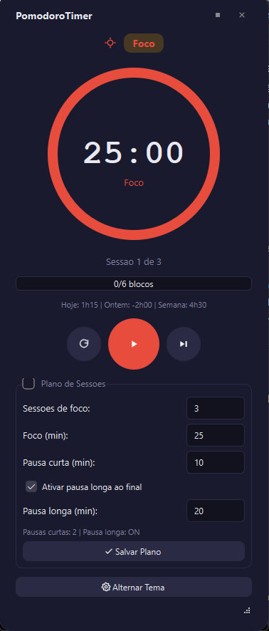

# PomodoroTimer

> Aplicativo desktop Pomodoro em PyQt6 com plano de sessões finito, overlay imersivo, histórico de foco diário e execução em bandeja do sistema.



## Funcionalidades

- Timer com progresso circular e contagem regressiva em tempo real
- Plano de sessões finito configurável (foco, pausa curta e pausa longa opcional)
- Encerramento gracioso do ciclo com estado de conclusão e ação "Novo Plano"
- Overlay fullscreen para transições de bloco e conclusão do plano
- Overlay de conclusão com resumo comparativo de foco (hoje x ontem) e total semanal
- Histórico de foco diário persistido, com migração automática do valor acumulado legado
- System tray com ações rápidas (mostrar, pausar/retomar, pular, sair)
- Persistência de configurações e histórico com QSettings
- Ícones SVG programáticos via `IconFactory` para consistência visual
- Arquitetura modular em `core/`, `ui/windows/` e `ui/components/`

## Como funciona

### 1. Plano de sessões finito

Ao abrir o app, você define o **Plano de Sessões**:

- **Sessões de foco**: quantos blocos de foco terá o ciclo
- **Foco (min)**: duração de cada bloco de foco
- **Pausa curta (min)**: duração da pausa entre os blocos de foco
- **Pausa longa (opcional)**: bloco final maior, para encerrar o ciclo

A partir desses valores, o `SessionPlan` (`core/session_plan.py`) monta a sequência completa de blocos
(ex.: Foco → Pausa curta → Foco → Pausa curta → Foco → Pausa longa) e passa a ser a única fonte de
verdade sobre "qual bloco está em execução agora" e "quanto falta para o plano acabar".

### 2. Execução do timer

O círculo de progresso central mostra a contagem regressiva do bloco atual e o rótulo de estado
(**Foco**, **Intervalo Curto** ou **Intervalo Longo**), cada um com sua cor própria. A barra
"X/Y blocos" indica o progresso dentro do plano. Os controles permitem:

- **Play/Pause**: inicia, pausa ou retoma o bloco atual
- **Pular**: avança imediatamente para o próximo bloco do plano
- **Reiniciar**: reseta o bloco atual

### 3. Transições e conclusão (overlay)

Ao final de cada bloco, uma janela em tela cheia (`OverlayWindow`) é exibida com som de notificação,
indicando o que acabou e o que vem a seguir — útil para sinalizar a troca de foco ↔ pausa mesmo que o
app esteja minimizado. Quando o **plano inteiro** é concluído:

- o timer para e os controles de execução são desabilitados
- aparece o overlay de **conclusão**, com o resumo de foco do dia comparado a ontem
- o ciclo só recomeça quando o usuário clica em **Novo Plano**

### 4. Histórico de foco diário

Cada bloco de foco concluído é registrado por `core/focus_history.py`. A barra de resumo mostra:

```
Hoje: 1h15 | Ontem: -2h00 | Semana: 4h30
```

— total de foco hoje, diferença em relação a ontem e soma da semana (segunda a domingo).

### 5. Bandeja do sistema (system tray)

O app continua rodando em segundo plano ao fechar a janela. Pelo ícone na bandeja é possível:

- ver o estado atual e o tempo restante no tooltip
- mostrar a janela principal (clique duplo)
- pausar/retomar e pular a sessão atual
- sair do aplicativo

## Download (usuários)

Os aplicativos prontos ficam em **[GitHub Releases](https://github.com/paulobiduss/PomodoroTimer/releases)**:

- **Windows**: `PomodoroTimer-vX.Y.Z-windows-portable.zip` — extraia e execute `PomodoroTimer.exe` (portátil, sem instalação).
- **macOS**: `PomodoroTimer-vX.Y.Z-macos.dmg` — abra o `.dmg` e arraste o `PomodoroTimer.app` para a pasta *Aplicativos*.

> **macOS (app não assinado):** como o app não é assinado/notarizado, na primeira
> abertura use **clique com o botão direito no app → Abrir** e confirme. Isso é
> necessário apenas uma vez.

## Pré-requisitos (desenvolvimento)

- Windows 10+ ou macOS
- Python 3.11+
- Pip

## Instalação e execução (modo desenvolvimento)

```bash
git clone https://github.com/paulobiduss/PomodoroTimer.git
cd PomodoroTimer
pip install -r requirements.txt
python main.py
```

## Testes

```bash
python -m unittest discover tests
```

## Gerar o executável (.exe)

```bash
build.bat
```

O script valida Python/PyInstaller, limpa artefatos antigos fora do Google Drive
e gera dois outputs:

- Executável: `C:\tmp\PomodoroTimer_dist\PomodoroTimer\PomodoroTimer.exe`
- Pacote portátil: `C:\tmp\PomodoroTimer_release\PomodoroTimer-portable.zip`

## Publicar um release (Windows + macOS)

Os pacotes oficiais para Windows e macOS são gerados automaticamente pelo GitHub
Actions (`.github/workflows/release.yml`) sempre que uma tag `vX.Y.Z` é enviada.
Não é possível compilar o app do macOS localmente no Windows — o workflow compila
cada plataforma em seu próprio runner (`windows-latest` e `macos-latest`).

```bash
git tag v1.0.0
git push origin v1.0.0
```

O workflow compila os dois pacotes e cria um **GitHub Release** com o `.zip`
(Windows) e o `.dmg` (macOS) anexados.

## Estrutura do projeto

```text
pomodoro/
- main.py
- requirements.txt
- build.bat
- README.md
- CHANGELOG.md
- .gitignore
- LICENSE
- assets/
  - icon.png
  - notify.wav
  - screenshots/
    - main_window.png
- tools/
  - generate_notify_sound.py
- core/
  - assets.py
  - constants.py
  - focus_history.py
  - icon_factory.py
  - session_plan.py
  - settings.py
- ui/
  - tray.py
  - components/
    - circular_progress.py
    - title_bar.py
  - windows/
    - overlay_window.py
    - timer_window.py
- tests/
  - test_focus_history.py
```

## Arquitetura

- `main.py`: composição de dependências, wiring de sinais e ciclo de vida do app
- `core/focus_history.py`: histórico diário, comparação com ontem e total semanal de foco
- `core/session_plan.py`: fonte de verdade da sequência finita de blocos
- `core/settings.py`: persistência de preferências e histórico do usuário
- `core/icon_factory.py`: geração de ícones SVG em runtime
- `core/assets.py`: resolução de caminhos de assets para dev e PyInstaller
- `ui/windows/timer_window.py`: janela principal e interação do plano com a UI
- `ui/windows/overlay_window.py`: overlays de transição e conclusão
- `ui/tray.py`: integração com bandeja do sistema

## Sobre o desenvolvimento

Este projeto foi desenvolvido com o auxílio de IA (Claude Code), que atuou como
desenvolvedor principal sob orientação e revisão do autor.

## Changelog

Veja [CHANGELOG.md](CHANGELOG.md) para o histórico de versões.

## Licença

Distribuído sob a licença MIT. Veja `LICENSE` para mais informações.
