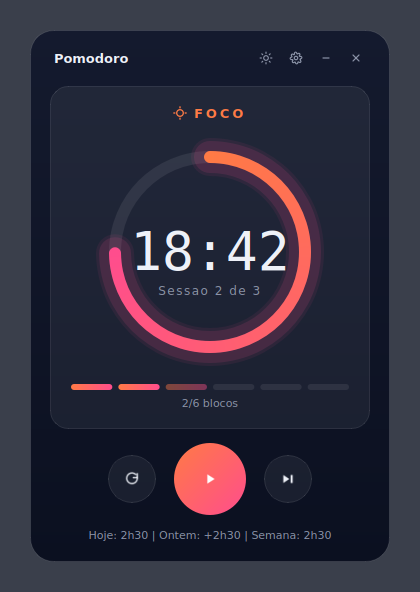
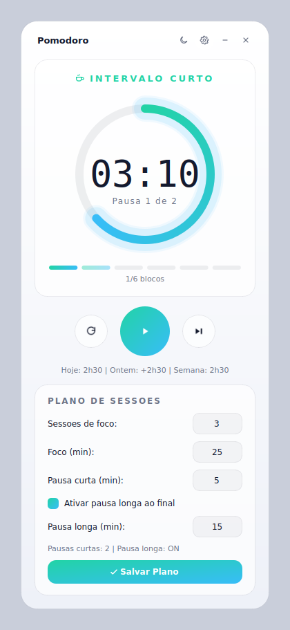
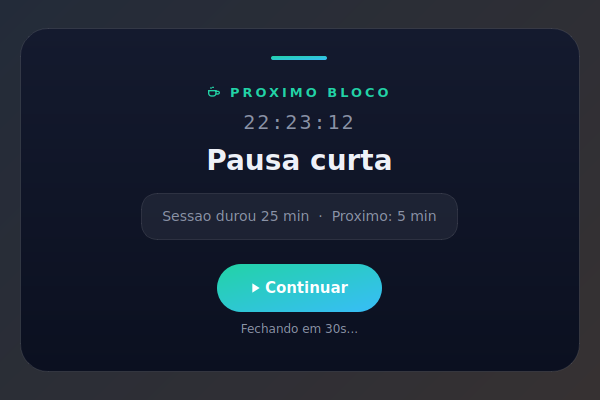
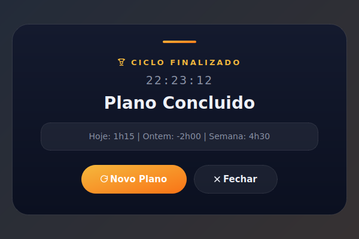
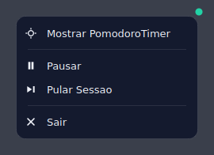

# PomodoroTimer

> Aplicativo desktop Pomodoro em PyQt6 com plano de sessões finito, overlay imersivo, histórico de foco diário e execução em bandeja do sistema.

**Para quem é:** quem quer blocos de foco com começo, meio e fim (ex.: "3 focos de 25 min e acabou"),
em vez de um timer que se repete para sempre. Roda no Windows e no macOS, com tema escuro ou claro.

**Versão atual:** 1.1.0 — novo visual "glass" minimalista. Baixe em [Releases](https://github.com/paulobiduss/PomodoroTimer/releases/latest).

| Tema escuro | Tema claro (pausa + painel do plano) |
|---|---|
|  |  |

## Funcionalidades

- Timer com progresso circular e contagem regressiva em tempo real
- Plano de sessões finito configurável (foco, pausa curta e pausa longa opcional)
- Encerramento gracioso do ciclo com estado de conclusão e ação "Novo Plano"
- Overlay fullscreen para transições de bloco e conclusão do plano
- Overlay de conclusão com resumo comparativo de foco (hoje x ontem) e total semanal
- Histórico de foco diário persistido, com migração automática do valor acumulado legado
- System tray com ações rápidas (mostrar, pausar/retomar, pular, sair)
- Persistência de configurações e histórico com QSettings
- Visual "glass" minimalista com tema escuro e claro (botão sol/lua na barra de título)
- Cada estado tem seu gradiente: foco (laranja → rosa), pausa curta (verde → azul), pausa longa (índigo → violeta)
- Barra segmentada com um segmento por bloco do plano
- Overlay de transição/conclusão e menu da bandeja seguem o mesmo visual e o tema escolhido
- Ícones SVG programáticos via `IconFactory` para consistência visual
- Arquitetura modular em `core/`, `ui/windows/` e `ui/components/`

## Como funciona

### 1. Plano de sessões finito

Clique na **engrenagem** da barra de título para abrir o painel **Plano de Sessões** e defina:

- **Sessões de foco**: quantos blocos de foco terá o ciclo
- **Foco (min)**: duração de cada bloco de foco
- **Pausa curta (min)**: duração da pausa entre os blocos de foco
- **Pausa longa (opcional)**: bloco final maior, para encerrar o ciclo

A partir desses valores, o `SessionPlan` (`core/session_plan.py`) monta a sequência completa de blocos
(ex.: Foco → Pausa curta → Foco → Pausa curta → Foco → Pausa longa) e passa a ser a única fonte de
verdade sobre "qual bloco está em execução agora" e "quanto falta para o plano acabar".

Clique em **Salvar Plano** para aplicar: o plano é reconstruído e começa do primeiro bloco.
Os valores ficam salvos para as próximas aberturas do app.

### 2. Execução do timer

O anel central mostra a contagem regressiva do bloco atual e, logo abaixo do tempo, em que ponto
do plano você está (ex.: "Sessao 2 de 3"). Acima do anel fica o rótulo do estado — **FOCO**,
**INTERVALO CURTO** ou **INTERVALO LONGO**. A barra segmentada abaixo do anel tem um segmento por
bloco: cheio = concluído, meio aceso = em andamento, apagado = pendente. Os controles:

- **Play/Pause** (botão central): inicia, pausa ou retoma o bloco atual
- **Pular**: avança imediatamente para o próximo bloco do plano
- **Reiniciar**: volta o plano inteiro para o primeiro bloco

### Temas e cores

O ícone de **sol/lua** na barra de título alterna entre tema escuro e claro; a escolha é salva e
vale também para o overlay e o menu da bandeja. Cada estado tem um gradiente próprio, aplicado ao
anel, ao botão principal e à barra segmentada:

| Estado | Gradiente |
|---|---|
| Foco | laranja → rosa |
| Pausa curta | verde → azul |
| Pausa longa | índigo → violeta |
| Plano concluído | âmbar → laranja |

As cores ficam em `ui/theme.py` (`DARK_PALETTE`, `LIGHT_PALETTE` e `STATE_GRADIENTS`).

### 3. Transições e conclusão (overlay)

Ao final de cada bloco, uma janela em tela cheia (`OverlayWindow`) é exibida com som de notificação,
mostrando o **próximo bloco**, quanto durou o bloco anterior e quanto dura o próximo — útil para
sinalizar a troca de foco ↔ pausa mesmo que o app esteja minimizado. **Continuar** (ou Enter, Espaço,
Esc) inicia o próximo bloco; sem interação, o overlay fecha sozinho em 30 s e o próximo bloco começa.

| Transição | Conclusão |
|---|---|
|  |  |

Quando o **plano inteiro** é concluído:

- o timer para e os controles de execução são desabilitados
- aparece o overlay de **conclusão**, com o resumo de foco do dia comparado a ontem
- o ciclo só recomeça quando o usuário clica em **Novo Plano**

### 4. Histórico de foco diário

Cada bloco de foco concluído é registrado por `core/focus_history.py`. A barra de resumo mostra:

```
Hoje: 1h15 | Ontem: -2h00 | Semana: 4h30
```

— total de foco hoje, diferença em relação a ontem e soma da semana (segunda a domingo).

### 5. Bandeja do sistema (system tray)

O app continua rodando em segundo plano ao fechar a janela (o **×** apenas oculta; o **–** minimiza).
O ícone da bandeja fica na cor do estado atual e cinza quando pausado. Pelo ícone é possível:



- ver o estado atual e o tempo restante no tooltip
- mostrar a janela principal (clique duplo)
- pausar/retomar e pular a sessão atual
- sair do aplicativo (**Sair** é a única forma de encerrar o app de verdade)

## Download (usuários)

Os aplicativos prontos ficam em **[GitHub Releases](https://github.com/paulobiduss/PomodoroTimer/releases)**:

- **Windows**: `PomodoroTimer-vX.Y.Z-windows-portable.zip` — extraia e execute `PomodoroTimer.exe` (portátil, sem instalação).
- **macOS**: `PomodoroTimer-vX.Y.Z-macos.dmg` — abra o `.dmg` e arraste o `PomodoroTimer.app` para a pasta *Aplicativos*.

> **macOS (app não assinado):** como o app não é assinado/notarizado, na primeira
> abertura use **clique com o botão direito no app → Abrir** e confirme. Isso é
> necessário apenas uma vez.

### Atualizar para uma nova versão

1. Encerre o app pela bandeja: ícone → **Sair** (fechar a janela só oculta).
2. **macOS:** abra o novo `.dmg`, arraste o `PomodoroTimer.app` para *Aplicativos* e escolha
   **Substituir**. **Windows:** extraia o novo `.zip` por cima da pasta antiga (ou em uma nova).
3. Abra o app. Plano, tema e histórico de foco são mantidos — eles ficam fora do app (veja
   [Onde ficam os dados](#onde-ficam-os-dados)).

### Onde ficam os dados

Configurações e histórico são salvos via `QSettings` em formato INI:

- **macOS:** `~/.config/PomodoroTimer/PomodoroTimer.ini`
- **Windows:** `%APPDATA%\PomodoroTimer\PomodoroTimer.ini`

Apagar esse arquivo volta o app para os valores padrão (4 focos de 25 min, tema escuro) e zera o histórico.

## Pré-requisitos (desenvolvimento)

- Windows 10+ ou macOS
- Python 3.11+
- Pip

## Instalação e execução (modo desenvolvimento)

```bash
git clone https://github.com/paulobiduss/PomodoroTimer.git
cd PomodoroTimer
pip install -r requirements.txt
python main.py
```

## Testes

```bash
python -m unittest discover tests
```

Os testes de UI criam widgets reais usando a plataforma `offscreen` do Qt (sem abrir janelas).
Em Linux sem interface gráfica (CI, containers), instale as bibliotecas do Qt antes:
`sudo apt-get install libegl1 libgl1 libxkbcommon0 libfontconfig1 libdbus-1-3`.

## Gerar o executável (.exe)

```bash
build.bat
```

O script valida Python/PyInstaller, limpa artefatos antigos fora do Google Drive
e gera dois outputs:

- Executável: `C:\tmp\PomodoroTimer_dist\PomodoroTimer\PomodoroTimer.exe`
- Pacote portátil: `C:\tmp\PomodoroTimer_release\PomodoroTimer-portable.zip`

## Publicar um release (Windows + macOS)

Os pacotes oficiais para Windows e macOS são gerados automaticamente pelo GitHub
Actions (`.github/workflows/release.yml`) sempre que uma tag `vX.Y.Z` é enviada.
Não é possível compilar o app do macOS localmente no Windows — o workflow compila
cada plataforma em seu próprio runner (`windows-latest` e `macos-latest`).

```bash
git tag v1.1.0
git push origin v1.1.0
```

O workflow compila os dois pacotes e cria um **GitHub Release** com o `.zip`
(Windows) e o `.dmg` (macOS) anexados. Também é possível disparar manualmente em
**Actions → Release → Run workflow**, informando a versão (ex.: `v1.1.0`); nesse caso a
tag é criada pelo próprio Release a partir do commit escolhido.

Antes de publicar, mova as entradas de "Não lançado" do `CHANGELOG.md` para a nova versão.

## Estrutura do projeto

```text
pomodoro/
- main.py
- requirements.txt
- build.bat
- README.md
- CHANGELOG.md
- .gitignore
- LICENSE
- assets/
  - icon.png
  - notify.wav
  - screenshots/
    - main_window.png
    - main_window_light.png
    - overlay_completion.png
    - overlay_transition.png
    - tray_menu.png
- tools/
  - generate_notify_sound.py
- core/
  - assets.py
  - constants.py
  - focus_history.py
  - icon_factory.py
  - session_plan.py
  - settings.py
- ui/
  - theme.py
  - tray.py
  - components/
    - circular_progress.py
    - fonts.py
    - segmented_progress.py
    - title_bar.py
  - windows/
    - overlay_window.py
    - timer_window.py
- tests/
  - test_focus_history.py
  - test_overlay_and_tray_theme.py
  - test_segmented_progress.py
  - test_theme.py
  - test_timer_window_theme.py
```

## Arquitetura

- `main.py`: composição de dependências, wiring de sinais e ciclo de vida do app
- `core/focus_history.py`: histórico diário, comparação com ontem e total semanal de foco
- `core/session_plan.py`: fonte de verdade da sequência finita de blocos
- `core/settings.py`: persistência de preferências e histórico do usuário
- `core/icon_factory.py`: geração de ícones SVG em runtime
- `core/assets.py`: resolução de caminhos de assets para dev e PyInstaller
- `ui/theme.py`: paletas escuro/claro, gradientes por estado e folhas de estilo (QSS) da janela, overlay e bandeja
- `ui/components/`: widgets desenhados à mão — anel (`circular_progress.py`), barra segmentada
  (`segmented_progress.py`), fontes compartilhadas (`fonts.py`) e barra de título arrastável
- `ui/windows/timer_window.py`: janela principal e interação do plano com a UI
- `ui/windows/overlay_window.py`: overlays de transição e conclusão
- `ui/tray.py`: integração com bandeja do sistema

## Solução de problemas

| Sintoma | Causa e solução |
|---|---|
| macOS: "não é possível abrir porque o desenvolvedor não pode ser verificado" | App sem notarização. Clique com o botão direito → **Abrir** → **Abrir**. |
| macOS: "PomodoroTimer está danificado" | Atributo de quarentena do download. Rode `xattr -dr com.apple.quarantine /Applications/PomodoroTimer.app` e abra de novo. |
| Fechei a janela e o app "sumiu" | Ele continua na bandeja/barra de menus. Clique duas vezes no ícone para mostrar a janela. |
| No macOS o menu da bandeja não segue o tema | Esperado: no macOS o menu da bandeja é nativo do sistema; só o ícone muda de cor. |
| Números do relógio em fonte diferente da captura | O relógio usa a primeira fonte monoespaçada instalada (JetBrains Mono, Cascadia Mono, SF Mono, Menlo, Consolas). |
| `ImportError: libEGL.so.1` ao rodar os testes no Linux | Faltam bibliotecas do Qt; veja a seção [Testes](#testes). |

## Sobre o desenvolvimento

Este projeto foi desenvolvido com o auxílio de IA (Claude Code), que atuou como
desenvolvedor principal sob orientação e revisão do autor.

## Changelog

Veja [CHANGELOG.md](CHANGELOG.md) para o histórico de versões.

## Licença

Distribuído sob a licença MIT. Veja `LICENSE` para mais informações.
